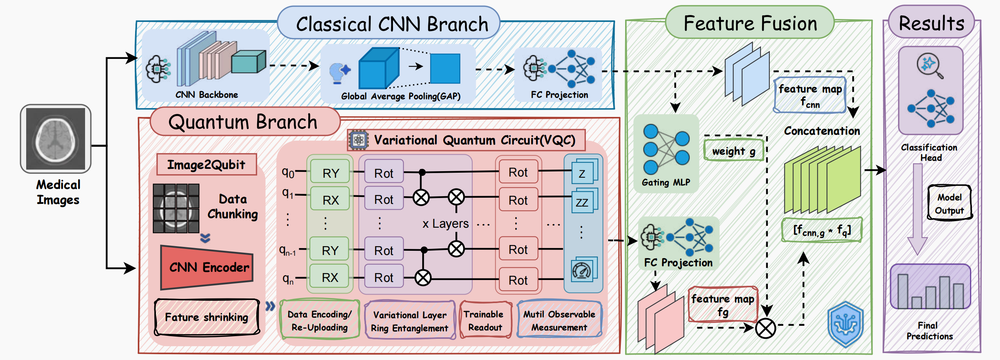
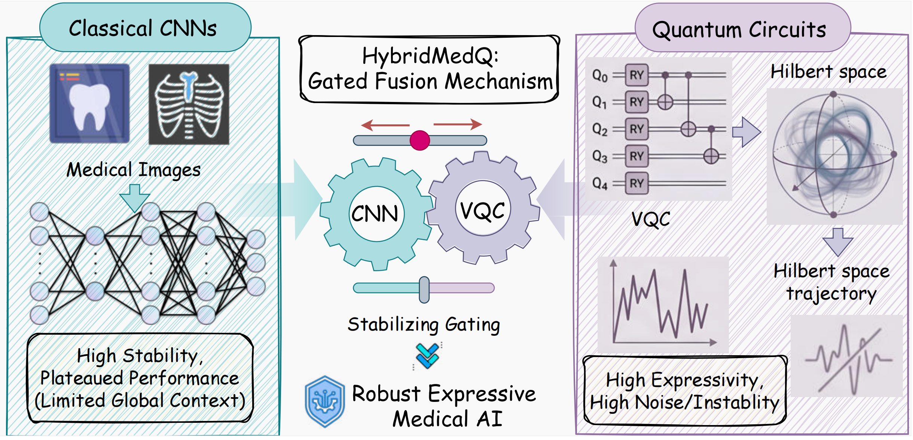

<div align="center">

# 🚀 HybridMedQ
### 🧠 Q-Gated Hybrid Networks for Robust Medical Image Learning

<p align="center">
  <em>Bridging classical CNN stability and quantum feature expressivity for robust medical image classification and segmentation.</em>
</p>

<p align="center">
  <strong>Hybrid Quantum-Classical Learning</strong> ·
  <strong>Medical Image Analysis</strong> ·
  <strong>Robustness under Shift</strong> ·
  <strong>Quantum-Gated Fusion</strong>
</p>

<p align="center">
  🔥 <strong>Under Review</strong>
</p>


</div>

---

## 🌟 Overview
<div align="center">
  

</div>


**HybridMedQ** is a hybrid quantum-classical framework for **robust medical image learning**.  
It combines a lightweight and stable **CNN branch** with a **variational quantum circuit (VQC) branch**, then uses a **sample-adaptive gating mechanism** to decide how much quantum information should be trusted for each input.

Instead of naively attaching a quantum layer to a vision model, HybridMedQ is designed around four key principles:

-  **Image-to-Qubits Bottleneck**  
  Compress visual features into a low-dimensional bounded representation before quantum encoding.

-  **Variational Quantum Feature Mixing**  
  Use entanglement and **data re-uploading** to model high-order interactions beyond local convolutions.

-  **Multi-Observable Readout**  
  Read out both **single-qubit Z** and **pairwise ZZ** expectations to expose richer correlation-aware quantum features.

-  **Reliability-Gated Fusion**  
  Learn a per-sample gate that suppresses unstable or redundant quantum signals and amplifies helpful ones.

>  HybridMedQ is not just more expressive — it is designed to be **stable, interpretable, and robust** in real medical imaging scenarios.

---

## 💡 Why HybridMedQ?

Medical image learning is inherently difficult:

-  scanner and protocol shifts  
-  variable resolution and lesion scale  
-  limited and imbalanced labels  
-  low-contrast and fuzzy boundaries  
-  need for both **local texture** and **global reasoning**

<div align="center">
  
  <p><em>Classical CNNs provide stable and efficient local representation learning, while quantum modules offer a complementary mechanism for modeling high-order and nonlocal feature interactions. HybridMedQ is designed to bridge these two strengths through a reliability-aware gated fusion strategy, enabling robust medical image learning under distribution shift, subtle lesion boundaries, and heterogeneous imaging conditions.</em></p>
</div>

| Model Type | Strength   | Weakness                   |
| ---------- | ---------- | -------------------------- |
| CNN        | Stable     | Limited global interaction |
| Quantum    | Expressive | Noisy / unstable           |

---

### 💥 Core Insight

> Keep the stability of CNNs  
> Unlock the expressivity of quantum feature mixing  
> Regulate everything with a learned confidence-aware gate  

---

##  Architecture

```
Input Image
     │
     ▼
┌──────────────┐
│ CNN Encoder  │
└──────────────┘
     │
     ├──────────────▶ Classical Features
     │
     ▼
┌────────────────────┐
│ Image → Qubits     │
│ (Bottleneck)       │
└────────────────────┘
     ▼
┌────────────────────┐
│ Variational Quantum│
│ Circuit (VQC)      │
└────────────────────┘
     ▼
┌────────────────────┐
│ Multi-Observable   │
│ Readout (Z + ZZ)   │
└────────────────────┘
     │
     ▼
┌────────────────────┐
│ Gated Fusion       │
│ (Adaptive Weight)  │
└────────────────────┘
     ▼
Prediction
```

---

## 🔑 Main Contributions

-  A practical hybrid quantum-classical architecture for **medical classification and segmentation**
-  A **capacity-controlled quantum bottleneck** to suppress redundancy before encoding
-  A **correlation-aware quantum readout** using Z and ZZ observables
-  A **sample-adaptive gating mechanism** for robust feature fusion
-  Extensive validation on **MedMNIST 2D / 3D** and **PH2**

---

##  Experimental Highlights

### 🖼 2D Medical Image Classification (MedMNIST)

Evaluated on:

- BloodMNIST  
- BreastMNIST  
- DermaMNIST  
- OrganAMNIST  
- OrganCMNIST  
- OrganSMNIST  
- PathMNIST  
- PneumoniaMNIST  

✔ Supports resolutions: **28 / 64 / 128 / 224**

---

### 🧊 3D Medical Image Classification

- AdrenalMNIST3D  
- NoduleMNIST3D  
- OrganMNIST3D  
- VesselMNIST3D  

---

### 🧬 Medical Image Segmentation (PH2)

HybridMedQ significantly improves segmentation quality over CNN baseline.

---

## 🏆 Selected Results

### MedMNIST (28×28)

- PathMNIST: **78.68**
- BloodMNIST: **94.18**
- OrganAMNIST: **87.06**
- OrganCMNIST: **85.88**

---

### PH2 Segmentation

| Metric | CNN    | HybridMedQ |
| ------ | ------ | ---------- |
| Dice   | 79.91  | **88.16**  |
| mIoU   | 66.54  | **78.82**  |
| HD95   | 103.10 | **42.67**  |

---

## 📁 Repository Structure

```
HybridMedQ/
├── preprocessing/     #  Data preprocessing
├── quantum/           #  Quantum modules and circuits
├── training/          # Training pipeline
├── run.sh            #  Quick start script
└── README.md
```


---

## 🚀 Quick Start


```
bash run.sh
```

---

## 🔬 Ablation Insights

- More qubits → stronger representation (default = 8)
-  Entanglement improves global reasoning
-  Gating stabilizes hybrid learning
-  Lower variance → better robustness

---

## 🎯 Applications

- medical image classification  
- lesion segmentation  
-  hybrid quantum machine learning  
-  domain generalization  
-  interpretable fusion  


---


<div align="center">

✨ Built for the future of Quantum Medical AI ✨

</div>
